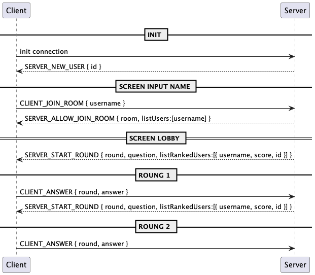

# CS494 - INTERNETWORKING PROTOCOL

## LAB 01: SOCKET PROGRAMMING

Student information:

| No. | Name                  | Student ID | Contribution (%) |
| --- | --------------------- | ---------- | ---------------- |
| 1   | Nguyen Huu Hung       | 19125046   | 34%              |
| 2   | Nguyen Cung Hoang Huy | 19125094   | 33%              |
| 3   | Nguyen Truong Lam     | 19125101   | 33%              |

Self evaluation

| No. | Requirements                            | Score | Evaluate |
| --- | --------------------------------------- | ----- | -------- |
| 1   | Use C/C++, Java, C#                     | 2     | 2        |
| 2   | Implement whole gameplay properly       | 3     | 3        |
| 3   | Socket Non-blocking                     | 2     | 2        |
| 4   | Have a good GUI (MFC, WPF, Swing, etc.) | 3     | 3        |
|     | `Total`                                 | `10`  | `10`     |

# GAME 02: RACING ARENA (6 + 4 + 1) % 3 = 2

## Demo

Demo gameplay: https://www.youtube.com/watch?v=0LcEe5ik-Lk&feature=youtu.be

## Techstacks

- Server side:

  - Using Java - Gradle for project management.
  - Using `java.net.ServerSocket` socket to init a server socket.
  - Using `java.util.concurrent.ExecutorService` to handle request to socket asynchronously (non-blocking handling).
  - Using `org.json`for JSON handling.

- Client side:
  - Using Unity for developing UI and Game Play.
  - Using `TcpClient` to make a TCP connection to server socket.
  - Using `Coroutines` to handle tasks asynchronously.
  - Using `Newtonsoft` for JSON parsing.

## Setup

- For client:
  - Unity version 2020.3.14f1
- For server:
  - Openjdk version "18"
  - Gradle 7.2

In server directory, run the script beflow for start server:

```bash
# start socket server
bash scripts/run.bash

# server will run at localhost:5555
```

## Specifications

### Data transfer flow



### Payload structure

Each packet will align to this format:

```yaml
- data:
	- payload: object
	- type: string
```

Packet with the prefix `SERVER_` is from server.
Packet with the prefix `CLIENT_` is from client.

- SERVER_NEW_USER: when user create a connection to server, server will send to client:

```JSON
// Example:
{
  "payload": {
    "id": "client-id-184f4741-f678-4319-9e97-c6f572e2ba8a"
  },
  "type": "SERVER_NEW_USER"
}
```

- CLIENT_JOIN_ROOM: when user want to send username and join lobby, client will send:

```JSON
// Example:
{
  "payload": {
    "username": "hunggg"
  },
  "type": "CLIENT_JOIN_ROOM"
}
```

- SERVER_ALLOW_JOIN_ROOM: when there is new user in lobby, server will send to all users in lobby to update UI:

```JSON
// Example:
{
  "payload": {
    "listUsers": [
      "client-1",
      "client-2",
      "client-3"
    ],
    "room": "room-id-41685726-9b2d-42d5-9f86-88da3565e93c"
  },
  "type": "SERVER_ALLOW_JOIN_ROOM"
}
```

- SERVER_START_ROUND: when there are enough users, server will send to all users in lobby to start game in round 1

```JSON
// Example:
{
  "payload": {
    "round": 1,
    "question": "69 * 77",
    "answer": "5313",
    "listRankedUser": [
      {
        "score": 0,
        "id": "client-id-94519999-00a8-40da-ae50-cb307a31f484",
        "username": "client-1"
      },
      {
        "score": 0,
        "id": "client-id-4e97ffd0-bb8c-41b2-89c4-972c0e7ce9f9",
        "username": "client-2"
      },
      {
        "score": 0,
        "id": "client-id-73b5dff2-ab72-4042-b2fe-1e9535274da8",
        "username": "client-3"
      },
      {
        "score": 0,
        "id": "client-id-a0acccf9-8cd4-47a8-9f6e-2a564707d114",
        "username": "hung114"
      }
    ]
  },
  "type": "SERVER_START_ROUND"
}
```

- CLIENT_ANSWER: client answer:

```JSON
// Example:
{
  "payload": {
    "round": 1,
    "answer": "20"
  },
  "type": "CLIENT_ANSWER"
}
```

To start next round, server will send the next `SERVER_START_ROUND` packet with different questions

### Snipet code

- Server:

```Java
// SocketServer.java

// Start server socket at client
socket = new ServerSocket(Configs.PORT);

// Submit service of listening new client join for non-blocking
executorService.submit(this::acceptNewClient);
```

```java
// ClientManager.java

// Add new client
public void add(Client client) {
    this.clients.put(client.getId(), client);

	// send to user packet SERVER_NEW_USER
    this.executorService.submit(() -> Providers.completeAddNewClient.handle(client));

	// Submit service of listening packet of this client for non-block
    this.executorService.submit(() -> Providers.clientListener.handle(client));
}

```

- Client:

```c#
// Init connection to server
public async Task ConnectAsTcpClient(string ip, int port)
{
	this.IP = ip;
	this.Port = port;
	int tryLeft = MAX_N_TRIAL;
	for(; tryLeft > 0; tryLeft--)
	{
		Debug.Log("[Client] - Trial left: " + tryLeft);
		await Task.Delay(millisecondsDelay: TRY_INTERVAL);
		tcpClient = new TcpClient();
		Debug.Log("[Client] Attempt connection to server " + ip + ":" + port);

		Task connectTask = tcpClient.ConnectAsync(ip, port);
		Task timeoutTask = Task.Delay(millisecondsDelay: TIMEOUT_MIL);

		if (await Task.WhenAny(connectTask, timeoutTask) == connectTask)
		{
			if (tcpClient.Connected)
				break;
		}

		if (tryLeft == 1)
		{
			throw new TimeoutException("~ConnectAsTcpClient->Time out after 10 trail!");
		}
	}

	Debug.Log("[Client] - isConnect: " + tcpClient.Connected);
	Debug.Log("[Client] Connected to server");
	stream = tcpClient.GetStream();
}

```

## Reference

[1] https://learn.microsoft.com/en-us/dotnet/api/system.net.sockets.tcpclient?view=net-7.0

[2] https://gist.github.com/joaoportela/6056200?fbclid=IwAR2NGJHHH0pdoWipQ8mzZcAVbPlBN5dxTpOyUNejbZvaOnZOxaiedJI-eW8
